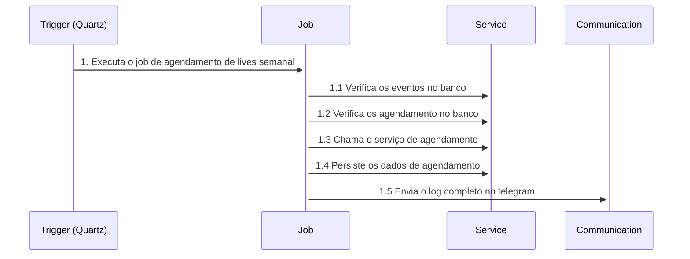

# Agendador de Taredas | Ad Ministerio Atos

Esse projeto se concentra em criar um agendador de tarefas para de forma assincrona e programada, executar ações como:
- Agendar lives no Youtube com base em eventos da Igreja
- Encaminhar mensagens de telegram/whatsapp programaticamente com base em linhas de uma tabela

## Arquitetura
O projeto precisa seguir uma arquitetura que lembre um pouco da clean arch, sendo:
- Core: 
    - modelos de dados (rich domain), 
    - serviços (tanto de dominio - um por modelo - quanto para multiplos dominios - ações especificas.
    - interfaces: aqui decidimos o contrato dos repositorios e serviços especificos
- Aplication: 
    - Commanders
    - Contratos para:
        - Serviços externos (storage, comunicação)
- Infra:
    - repositorios concretos (usando o ORM
    - mapeadores (classmap do nhibernate)
    - serviços/helpers/utils que implementam concretamente os serviços especificados na aplicação
- Jobs
    - Contratos: interfaces dos jobs

## Fluxo
### Agendador de lives no youtube

## Proximos passos
- [ ] Criar endpoints para rodar um job manualmente
- [x] Alterar a forma de comunicação com o banco de rest para SQL (NHibernate)
- [x] Usar o Liquibase para criar e versionar o banco
- [ ] Verificar o uso das SDKs do Telegram, Youtube e Cloudnary em vez das APIs
